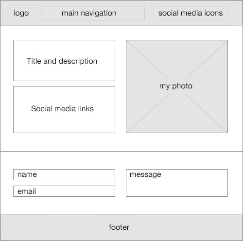
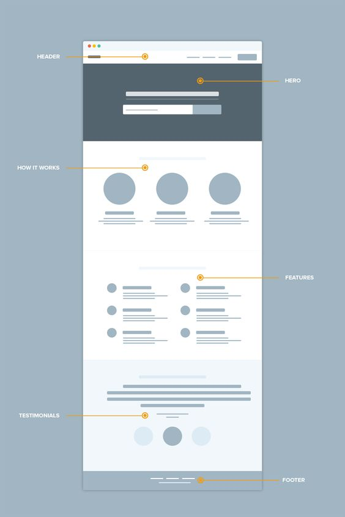
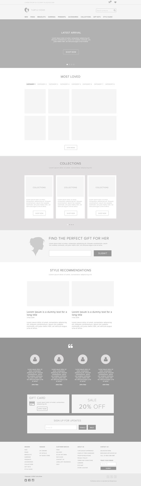

# Creating Web Pages using Hypertext Markup Language (HTML)

The main goal of this module is to build a website with HTML only.

You can help with the guided exercises that we have in the homework folder

For this, I challenge you to believe any of the following wiframe:

